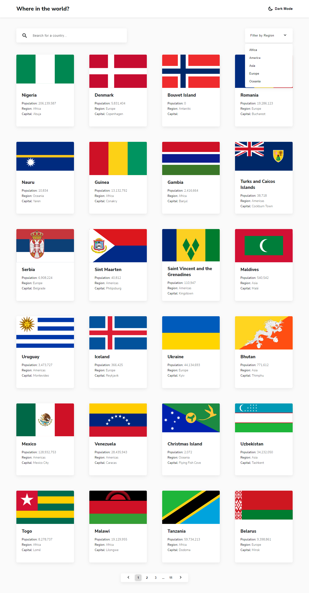

# Frontend Mentor - REST Countries API with color theme switcher solution

This is a solution to the [REST Countries API with color theme switcher challenge on Frontend Mentor](https://www.frontendmentor.io/challenges/rest-countries-api-with-color-theme-switcher-5cacc469fec04111f7b848ca). Frontend Mentor challenges help you improve your coding skills by building realistic projects. 

## Table of contents

- [Overview](#overview)
  - [The challenge](#the-challenge)
  - [Screenshot](#screenshot)
  - [Links](#links)
- [My process](#my-process)
  - [Built with](#built-with)
  - [What I learned](#what-i-learned)
- [Author](#author)

## Overview

### The challenge

Users should be able to:

- See all countries from the API on the homepage
- Search for a country using an `input` field
- Filter countries by region
- Click on a country to see more detailed information on a separate page
- Click through to the border countries on the detail page
- Toggle the color scheme between light and dark mode

### Screenshot

### Links

- Solution URL: https://www.frontendmentor.io/solutions/rest-countries-with-pagination-using-reactjs-typescript-scss-fxVfynSCv
- Live Site URL: https://lukakobaidze-restcountries.netlify.app/

## My process

### Built with

- [React](https://reactjs.org/) - JS library
- TypeScript
- SCSS
- React Router v6

### What I learned

During this challenge, I learned how to implement Searchbar, Pagination, Loading spinner. I also learned how to work with APIs and fetch data. Learned how to use useCallback and useMemo hooks and differences between these two.

## Author

- Frontend Mentor - [@LukaKobaidze](https://www.frontendmentor.io/profile/LukaKobaidze)
- FreeCodeCamp - [@lukakobaidze](https://www.freecodecamp.org/lukakobaidze)
